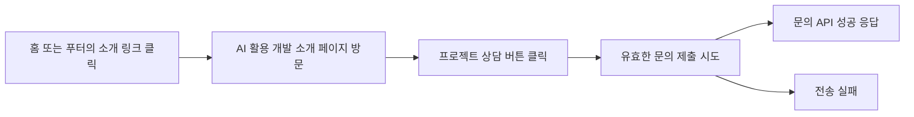

## 요약

포베리 홈페이지에서는 방문자 수보다 **어떤 경로로 들어온 사람이 설명을 읽고 실제 문의를 남기는지**를 먼저 봅니다.
주 1회 최근 28일과 직전 28일을 비교하고, 방문·상담 클릭·문의 성공을 구분합니다.
이 문서는 운영 절차이며 실제 GA 계정의 수치나 설정을 조회한 결과가 아닙니다.

## 이번 측정 범위

| 행동 | GA 이벤트 이름 | 구분 값 | 해석 |
|---|---|---|---|
| 소개 링크 클릭 | `ai_workflow_link_click` | `link_location`: `home_section`, `footer` | 어디의 소개 링크가 사용되는지 |
| 페이지 방문 | `page_view` (기존) | 페이지 경로 `/how-we-work/` | 직접 방문과 검색 유입도 포함 |
| 목차·수행 실적 클릭 | `ai_workflow_navigation` | `destination`: `process`, `experience`, `principles`, `questions`, `work` | 방문자가 찾아본 주제. 섹션을 읽었다는 증거는 아님 |
| 소개 페이지의 상담 클릭 | `contact_cta_click` | `inquiry_source`: `how_we_work`, `inquiry_location`: `hero`, `cta_band` | 상담에 관심을 보인 단계 |
| 필수 입력 검증을 통과한 전송 시도 | `contact_submit_attempt` | 위 상담 진입 값 | 실제 요청을 시도한 횟수. 입력 오류·단순 폼 방문은 제외 |
| 문의 API 성공 응답 | `generate_lead` (기존 확장) | 위 상담 진입 값 + 기존 선택 항목 | 홈페이지 문의 접수 성공. 계약·매출·최종 메일 전달 성공과는 구분 |
| 전송 실패 | `contact_submit_failed` (기존 확장) | 위 상담 진입 값 + `inquiry_type` | 첨부 처리나 API 전송 오류 점검 |
| 전화·이메일 클릭 | `contact_channel_click` (기존) | `channel`, `link_location` | 통화 연결·메일 발송 완료가 아닌 클릭 |

`contact_cta_click`은 이번 AI 소개 페이지의 상단·하단 상담 버튼에 추가했습니다. 다른 페이지의 모든 상담 버튼을 포괄하는 이벤트는 아닙니다.
기존 솔루션의 `solution_inquiry_click` 이벤트와 문의 성공·실패 이벤트는 유지합니다.

상담 링크에 고정된 `inquiry_source`와 `inquiry_location`을 전달하고 제출 시점의 값을 기록합니다.
임의 문자열·중복 파라미터는 허용하지 않으며, 이름·이메일·전화번호·문의 본문·첨부파일명은 새 GA 매개변수에 넣지 않습니다.
표식이 없는 문의는 `unattributed` / `unknown`입니다. 이는 GA의 외부 유입 경로인 Direct를 뜻하지 않습니다.
이 값은 **해당 상담 링크를 통한 진입 표시**이며 전체 방문 이력이나 첫 유입 출처가 아닙니다.
다른 경로로 다시 이동해 표식이 없어지면 이전 소개 페이지 방문에 소급 귀속하지 않습니다. 내부 링크에는 UTM을 붙이지 않습니다.

## 처음 한 번 확인할 설정

GA에서 포베리 속성을 선택하고 **관리 → 데이터 스트림 → 웹 스트림**에서 사이트 주소와 측정 ID `G-5WNYBB6NQY`를 확인합니다.
메뉴는 권한·보고서 구성에 따라 다를 수 있으므로 보이지 않으면 상단 검색에서 아래 보고서 이름을 찾습니다.

1. **페이지 이동 측정:** 향상된 측정의 페이지 조회 고급 설정에서 브라우저 방문 기록 변경에 따른 페이지 조회를 확인합니다.
   사이트는 새로고침 없는 이동을 사용합니다. 기존 자동 측정을 유지하며 코드에서 `page_view`를 중복 전송하지 않습니다.
   직접 접속과 내부 링크 이동을 각각 확인해야 합니다. [Google SPA 측정 안내](https://developers.google.com/analytics/devguides/collection/ga4/single-page-applications)
2. **핵심 이벤트:** 관리의 데이터 표시 영역에서 `generate_lead`가 핵심 이벤트로 표시되어 있는지 확인합니다.
   이미 등록되어 있다면 유지합니다. 없으면 같은 이름을 핵심 이벤트로 등록합니다.
   기존 코드가 이 이벤트를 보내므로 `form_submit`이나 버튼 클릭에서 동일 이름의 이벤트를 다시 생성하지 않습니다.
   상담 클릭·제출 시도를 문의 성공과 같은 핵심 성과로 합산하지 않습니다. [Google 핵심 이벤트 안내](https://support.google.com/analytics/answer/12946393?hl=ko)
3. **맞춤 측정기준:** 관리 → 데이터 표시 → 맞춤 정의에서 아래 매개변수를 **이벤트 범위**로 등록합니다.
   기존에 같은 매개변수가 등록되어 있으면 재사용합니다. 등록·수집 후 보고서 사용까지 24~48시간이 걸릴 수 있습니다.
   [Google 맞춤 측정기준 안내](https://support.google.com/analytics/answer/14240153?hl=ko)

| 표시 이름 예시 | 이벤트 매개변수 | 용도 |
|---|---|---|
| 상담 진입 콘텐츠 | `inquiry_source` | `how_we_work`를 통한 문의 구분 |
| 상담 버튼 위치 | `inquiry_location` | 상단 `hero`와 하단 `cta_band` 비교 |
| 링크 위치 | `link_location` | 홈·푸터 및 기존 연락 링크 구분 |
| 소개 페이지 이동 대상 | `destination` | 목차와 실적 링크 비교 |

4. **수집 확인:** 배포 후 실시간 보고서에서 소개 링크와 상담 버튼 클릭을 확인합니다.
   문의 성공은 실제 고객 문의 또는 별도로 합의한 테스트 문의로 확인합니다. 수집 확인만을 위해 운영 문의를 반복 전송하지 않습니다.
   DebugView를 쓰려면 테스트 브라우저에 디버그 모드를 별도로 활성화해야 하며 전체 운영 방문자에게 켜지 않습니다.
   로컬 개발 서버는 기본적으로 GA를 끕니다. 로컬 검증 성공이 운영 GA 보고서 수신 확인을 대신하지 않습니다.

## 매주 10분 확인할 화면

같은 기간·동일한 필터를 사용합니다. 최근 28일을 기본으로 두되 방문이 적으면 기간을 늘리고, 변경 배포일을 따로 기록합니다.
배포 전에는 새 이벤트가 없으므로 이전 0건과 비교해 개선 효과를 단정하지 않습니다.

| 확인할 질문 | GA 화면과 보는 값 | 다음 행동 |
|---|---|---|
| 어떤 유입이 문의로 이어지나? | **트래픽 획득**: 세션 소스/매체, 세션, `generate_lead` 핵심 이벤트, 세션 핵심 이벤트율 | 방문만 많은 채널보다 문의로 이어지는 채널의 메시지·도착 페이지를 검토 |
| AI 소개가 읽히나? | **페이지 및 화면**: 페이지 경로 `/how-we-work/`, 활성 사용자·조회수·평균 참여 시간 | 조회가 적으면 진입 링크를, 조회는 있으나 상담 클릭이 적으면 설명·근거·상담 제안을 점검 |
| 어느 단계에서 멈추나? | **탐색 → 유입경로 탐색**: 아래 4단계의 사용자 수·이탈 | 이탈이 큰 단계부터 하나씩 개선 |
| 모바일에서 특히 어렵나? | 같은 탐색을 **기기 카테고리**로 분류 | 모바일만 이탈이 높으면 입력·버튼·스크롤·속도를 재현 확인 |
| 문의가 기술적으로 실패하나? | **이벤트**: `contact_submit_attempt`, `contact_submit_failed`, `generate_lead` | 실패가 나타나면 메일 프록시·첨부 처리·서버 로그 확인 |

트래픽 획득의 세션 소스/매체는 각 방문의 유입을, 사용자 획득은 최초 유입을 보는 지표이므로 혼용하지 않습니다.
평균 참여 시간은 화면이 활성화된 시간이며 내용 이해도나 만족도 자체가 아닙니다.
[Google 트래픽 획득 안내](https://support.google.com/analytics/answer/12923437?hl=ko), [페이지 및 화면 안내](https://support.google.com/analytics/answer/12926732?hl=ko)

## AI 소개의 문의 흐름 만들기

**탐색 → 유입경로 탐색**에서 이름을 `AI 소개 → 문의`로 저장하고 다음 단계를 만듭니다.

1. 이벤트 이름 = `page_view` **그리고** 페이지 경로 = `/how-we-work/`.
2. 이벤트 이름 = `contact_cta_click` **그리고** 상담 진입 콘텐츠 = `how_we_work`.
3. 이벤트 이름 = `contact_submit_attempt` **그리고** 상담 진입 콘텐츠 = `how_we_work`.
4. 이벤트 이름 = `generate_lead` **그리고** 상담 진입 콘텐츠 = `how_we_work`.

우선 **닫힌 유입경로**로 설정해 소개 페이지에서 출발한 사용자를 봅니다.
단계 사이 다른 이벤트가 끼어도 이어지도록 간접 다음 단계를 사용하고, 각 다음 단계는 우선 30분 이내로 설정합니다.
이는 첫 운영 비교 기준이며 동일 세션 제한과 같지 않습니다. 상담 의사결정이 길다면 시간 조건을 별도로 조정합니다.
소개 링크를 거치지 않은 검색·직접 방문도 포함하려고 1단계를 링크 클릭 대신 페이지 조회로 둡니다.
홈과 푸터 진입 비교는 별도 자유 형식 탐색에서 `ai_workflow_link_click`의 **링크 위치 × 총 사용자·이벤트 수**로 봅니다.
[Google 유입경로 탐색 안내](https://support.google.com/analytics/answer/9327974?hl=ko)

이벤트 횟수를 서로 나눠 사람의 전환율로 해석하지 않습니다. 같은 사람이 여러 번 클릭·재시도할 수 있으므로 사용자 전환은 위 탐색으로 봅니다.
전송 오류 진단에는 동일 기간의 실패 이벤트 수 / 시도 이벤트 수를 참고할 수 있지만 기간 경계·추적 차단·페이지 종료 때문에 완전한 서버 성공률은 아닙니다.

## 수치를 개선 판단으로 연결하는 예

아래는 판단 방법의 예시이며 현재 사이트에서 관찰한 사실이 아닙니다.

- **방문 자체가 적다:** 페이지 내용만 고치기 전에 홈 진입 링크, 검색 유입과 Search Console의 노출·클릭을 확인합니다.
- **방문은 있으나 상담 클릭이 적다:** 실제 수행 사례, 적용 범위와 조건, 상담으로 얻을 수 있는 내용을 더 명확히 합니다. 오래 머문다는 이유만으로 성공이라 판단하지 않습니다.
- **상담 클릭은 있으나 제출 시도가 적다:** 폼 이동이 정상인지, 필수 항목과 개인정보 동의가 명확한지, 모바일 입력이 어려운지 확인합니다. 전화·이메일로 전환했을 수도 있습니다.
- **제출 시도 후 실패가 있다:** 마케팅 문구보다 기술적 전송 문제를 먼저 해결합니다. 브라우저 종료나 차단도 있으므로 시도·성공 차이 전부를 서버 오류로 보지는 않습니다.
- **문의는 늘었지만 적합한 상담이 적다:** 내부 상담 기록에서 프로젝트 적합도를 검토합니다. 개인정보나 상담 원문을 GA로 보내지 않습니다.

표본이 적을 때 비율만으로 결론 내리지 말고 실제 인원·문의 건수도 함께 봅니다. 한 번에 한 가지를 바꾸고 변경일·가설·비교 기간·결과를 기록합니다.
GA의 유입 데이터만으로 AI 답변 노출·인용 수를 알 수는 없습니다. 식별 가능한 추천 유입은 참고하되 GEO·AEO 전체 성과와 동일시하지 않습니다.

## 적용·검증 기록

- 코드의 이벤트 추가와 계정의 핵심 이벤트·맞춤 정의 등록은 별도 작업입니다. 이 변경에서는 GA 관리 화면을 수정하지 않았습니다.
- 기존 공통 GA 설정, 로컬 비활성화, 자동 페이지 조회와 개인정보 제외 원칙을 유지합니다.
- 문의 API와 메일 템플릿 계약은 변경하지 않았습니다. 추가 매개변수는 GA에만 전달합니다.
- 정적 생성 명령 `node node_modules/nuxt/bin/nuxt.mjs generate`를 통과했습니다. 기존 npm 실행 경로 문제로 Nuxt CLI를 직접 사용했고, 기존 Nitro cache-driver 경고는 남아 있습니다.
- 생성된 14개 페이지의 대표 URL·제목·h1과 FAQ 34개의 본문 일치를 확인하고, 배포 텍스트 파일 59개에서 비공개 프로젝트 명칭 미노출을 확인했습니다.
- 격리된 Chrome에서 홈·푸터 진입, 목차·실적 링크, 상단·하단 상담 클릭, 390px 화면과 키보드 실행을 검증했습니다. 문의 API는 성공·실패 응답을 모의 처리하고 외부 요청은 차단했습니다.
- 입력 검증 실패 시 제출 이벤트가 발생하지 않는 것, 유효한 제출 1회당 시도·결과 이벤트가 각각 1회인 것, 새로고침 후 출처 유지, 개인정보가 이벤트에 포함되지 않는 것을 확인했습니다.
- URL 구분 값의 누락·변조·중복과 제출 시점 출처 보존을 별도 검사했습니다. 실제 GA 수신, 향상된 측정 설정, 운영 문의 전송은 미검증입니다.
